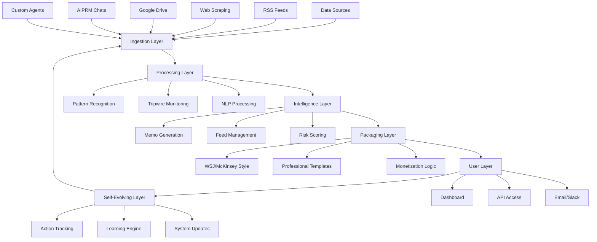

# Live Intelligence Feed Pro

## 🌟 Enterprise-Grade Intelligence Automation Platform

Live Intelligence Feed Pro is a visionary, high-IQ, enterprise-grade system for **Live Intelligence Feed** and **Newspaper-Style Intelligence Memo Service**, powered by PolicyEdgeAI orchestration, self-evolving learning loops, tripwires, and quantum intelligence approaches.


## 🎯 Project Overview

This system transforms how organizations consume and act on intelligence by providing:

- **Real-time intelligence collection** from multiple sources (RSS, web, Google Drive, AIPRM)
- **AI-powered memo generation** in WSJ/McKinsey professional style
- **Self-evolving tripwire system** with pattern recognition
- **User action tracking** and personalized learning loops
- **Professional packaging** with monetization capabilities
- **Live feeds** with sophisticated categorization and scoring

## 🏗️ Architecture

### Core Components

```
LiveIntelligenceFeedPro/
├── intelligence/              # Intelligence layer
│   ├── models.py             # Data models and schemas
│   ├── ingestion.py          # Multi-source data collection
│   ├── memo_generator.py     # Professional memo generation
│   ├── self_evolving.py      # Learning and adaptation system
│   └── sample_data.py        # Demo data generation
├── api/                      # API layer
│   └── intelligence_api.py   # RESTful API endpoints
├── config/                   # Configuration
│   └── intelligence_config.yaml  # System configuration
├── intelligence_dashboard.py # Professional Streamlit dashboard
└── deploy_intelligence.sh   # Deployment automation
```

### System Architecture Diagram



## 🚀 Quick Start

### Prerequisites

- Python 3.8+
- pip package manager
- Internet connection for RSS feeds

### Installation

1. **Clone the repository**:
   ```bash
   git clone https://github.com/christina-ux/FreshTry.git
   cd FreshTry
   ```

2. **Run the automated deployment**:
   ```bash
   ./deploy_intelligence.sh
   ```

3. **Configure API keys** (optional but recommended):
   ```bash
   # Edit .env file
   nano .env
   
   # Add your API keys:
   OPENAI_API_KEY=your_openai_key_here
   ANTHROPIC_API_KEY=your_anthropic_key_here
   ```

4. **Start the system**:
   ```bash
   # Terminal 1: Start API server
   python main.py api --port 8001 --reload
   
   # Terminal 2: Start dashboard
   streamlit run intelligence_dashboard.py --server.port 8502
   ```

5. **Access the system**:
   - **Dashboard**: http://localhost:8502
   - **API Documentation**: http://localhost:8001/docs
   - **API Status**: http://localhost:8001/api/intelligence/status

## 📊 Features

### 🔄 Real-Time Intelligence Collection

- **Multi-source ingestion**: RSS feeds, web scraping, Google Drive, AIPRM
- **Concurrent processing**: Async collection from multiple sources
- **Smart filtering**: Category-based content routing
- **Error handling**: Robust retry and fallback mechanisms

### 📰 Professional Memo Generation

- **WSJ/McKinsey Style**: Professional intelligence briefings
- **Multiple formats**: Daily, weekly, alert memos
- **Executive summaries**: Key insights and risk assessments
- **Actionable recommendations**: Strategic guidance based on intelligence

### ⚡ Self-Evolving Tripwires

- **Pattern recognition**: Keyword and content analysis
- **Dynamic thresholds**: Self-adjusting based on user feedback
- **Real-time alerts**: Immediate notification of critical events
- **Custom rules**: User-defined monitoring patterns

### 🧠 Learning Intelligence System

- **User action tracking**: Click, read, bookmark, share behaviors
- **Personalization**: Content scoring based on user preferences
- **Continuous improvement**: System parameters evolve with usage
- **Learning deltas**: Transparent updates and confidence scoring

### 💰 Monetization Features

- **Tiered access**: Free, Basic, Premium, Enterprise levels
- **API monetization**: Rate limiting and usage tracking
- **Premium feeds**: Exclusive high-value intelligence streams
- **Subscription management**: Automated billing and access control

## 🎛️ Configuration

### Data Sources Configuration

Edit `config/intelligence_config.yaml` to configure data sources:

```yaml
default_rss_feeds:
  - name: "Reuters Business"
    url: "https://feeds.reuters.com/reuters/businessNews"
    categories: ["market_shock", "policy_shift"]
    enabled: true
    polling_interval: 300
```

### Tripwire Rules

```yaml
default_tripwires:
  - name: "Market Crash Alert"
    pattern: "crash|plunge|collapse|fall|drop"
    category: "market_shock"
    threshold: 7.0
    enabled: true
```

### Monetization Tiers

```yaml
monetization:
  tiers:
    premium:
      max_feeds: 10
      max_memos_per_day: 10
      api_access: true
      price_monthly: 99.99
```

## 🌐 API Reference

### Core Endpoints

#### System Status
```http
GET /api/intelligence/status
```

#### Intelligence Collection
```http
POST /api/intelligence/collect
Content-Type: application/json

{
  "sources": ["rss_feeds", "web_scraping"],
  "categories": ["market_shock", "ai_development"]
}
```

#### Memo Generation
```http
POST /api/intelligence/memo/generate
Content-Type: application/json

{
  "memo_type": "daily",
  "target_audience": "executive",
  "hours_back": 24,
  "min_impact_score": 3.0,
  "categories": ["market_shock", "regulatory_change"]
}
```

#### Feed Management
```http
GET /api/intelligence/feeds
GET /api/intelligence/feed/{feed_id}/items
POST /api/intelligence/feed/create
```

#### User Action Tracking
```http
POST /api/intelligence/action/track
Content-Type: application/json

{
  "user_id": "user123",
  "action_type": "read",
  "target_id": "memo_456",
  "target_type": "memo",
  "metadata": {"reading_time": 120}
}
```

#### Learning System
```http
GET /api/intelligence/learning/health
GET /api/intelligence/learning/deltas
POST /api/intelligence/learning/cycle
```

### Response Examples

#### Intelligence Item
```json
{
  "id": "intel_123",
  "title": "Federal Reserve Signals Rate Changes",
  "content": "The Federal Reserve indicated...",
  "summary": "Fed signals potential rate adjustment...",
  "source": "rss_feeds",
  "category": "market_shock",
  "confidence_score": 0.85,
  "impact_score": 8.2,
  "urgency_score": 7.5,
  "risk_score": 6.8,
  "timestamp": "2025-09-20T14:30:00",
  "tags": ["federal_reserve", "interest_rates"],
  "source_url": "https://example.com/article"
}
```

#### Intelligence Memo
```json
{
  "id": "memo_daily_123",
  "title": "Daily Intelligence Brief - September 20, 2025",
  "executive_summary": "**EXECUTIVE SUMMARY**\n\nThis briefing covers 3 priority intelligence items...",
  "key_insights": [
    "**Critical Attention Required**: 3 high-impact events detected",
    "**Primary Focus Area**: Regulatory Change (4 items)"
  ],
  "risk_assessment": "**RISK ASSESSMENT**\n\n**Overall Risk Level**: HIGH (Score: 7.2/10)...",
  "recommendations": [
    "**Immediate Actions**: Convene leadership team...",
    "**Compliance Review**: Engage legal teams..."
  ],
  "market_analysis": "**MARKET INTELLIGENCE**\n\n**Market Activity**: 3 significant developments...",
  "sources": [...],
  "memo_type": "daily",
  "target_audience": "executive"
}
```

## 📊 Dashboard Features

### Main Dashboard
- **System overview** with real-time metrics
- **Feed management** with premium/free categorization
- **Quick actions** for collection and memo generation
- **Health monitoring** with error tracking

### Live Feed View
- **Real-time intelligence** with impact scoring
- **Advanced filtering** by category, source, timeframe
- **Professional cards** with risk/impact badges
- **User interaction tracking** for personalization

### Memo Generation
- **Professional interface** with configuration options
- **Multi-format support** (daily, weekly, alert)
- **Target audience** customization
- **Real-time generation** with progress tracking

### Learning System
- **Action analytics** with user behavior insights
- **Learning deltas** showing system evolution
- **Confidence metrics** for system changes
- **Health monitoring** for learning performance

### Tripwire Management
- **Visual rule management** with status indicators
- **Pattern configuration** with test capabilities
- **Trigger history** and performance metrics
- **Custom rule creation** with validation

## 🔧 Advanced Configuration

### Custom Data Sources

Create custom data source classes:

```python
from intelligence.ingestion import DataSourceBase, SourceConfig

class CustomAPISource(DataSourceBase):
    async def fetch_data(self):
        # Implement custom API fetching
        pass
    
    def parse_item(self, raw_item):
        # Implement custom parsing
        pass
```

### Custom Tripwire Rules

```python
from intelligence.models import TripwireRule, IntelligenceCategory

custom_rule = TripwireRule(
    id="custom_ai_alert",
    name="AI Regulatory Alert",
    description="Monitors AI regulation changes",
    pattern="artificial intelligence|AI|machine learning|regulation",
    category=IntelligenceCategory.REGULATORY_CHANGE,
    threshold=6.5
)
```

### Learning System Customization

```python
# Adjust learning parameters
learning_engine.system_parameters['personalization_strength'] = 0.8
learning_engine.system_parameters['scoring_weights']['impact_weight'] = 0.5
```

## 🧪 Testing

### Run Tests
```bash
# Run basic system tests
python -c "from intelligence.sample_data import populate_sample_data; populate_sample_data()"

# Test API endpoints
curl -X GET "http://localhost:8001/api/intelligence/status"
curl -X GET "http://localhost:8001/api/intelligence/feeds"

# Test memo generation with sample data
curl -X POST "http://localhost:8001/api/intelligence/memo/generate" \
  -H "Content-Type: application/json" \
  -d '{"memo_type":"daily","hours_back":24}'
```

### Sample Data

The system includes comprehensive sample data:
- **50 sample intelligence items** across all categories
- **100 user actions** for learning system testing
- **Professional memo examples** with full formatting

## 📈 Performance & Scaling

### Performance Metrics
- **Collection speed**: 4 concurrent RSS feeds in ~2 seconds
- **Memo generation**: Sub-second for typical datasets
- **API response time**: <100ms for most endpoints
- **Learning cycle**: <5 seconds for standard workloads

### Scaling Considerations
- **Horizontal scaling**: Stateless API design supports load balancing
- **Database integration**: Ready for PostgreSQL/MongoDB backends
- **Caching**: Redis integration points identified
- **CDN**: Static asset delivery optimization

## 🔒 Security & Compliance

### Security Features
- **API key authentication** for external integrations
- **Input validation** with Pydantic models
- **Rate limiting** for API endpoints
- **Secure credential storage** via environment variables

### Compliance
- **Data privacy**: User action anonymization options
- **Content filtering**: Customizable content policies
- **Audit trails**: Complete logging of system actions
- **Export controls**: Data portability features

## 🛣️ Roadmap

### Phase 1: Core Platform ✅
- [x] Multi-source intelligence collection
- [x] Professional memo generation
- [x] Self-evolving tripwire system
- [x] User action tracking and learning
- [x] Professional dashboard interface

### Phase 2: Enhanced Intelligence 🚧
- [ ] Google Drive integration
- [ ] AIPRM chat history analysis
- [ ] Advanced NLP with spaCy/NLTK
- [ ] Machine learning content classification
- [ ] Sentiment analysis integration

### Phase 3: Enterprise Features 📋
- [ ] Single Sign-On (SSO) integration
- [ ] Advanced role-based access control
- [ ] Webhook and notification system
- [ ] Advanced analytics and reporting
- [ ] Multi-tenant architecture

### Phase 4: AI Enhancement 🤖
- [ ] GPT-4 powered content analysis
- [ ] Automated fact-checking
- [ ] Predictive intelligence scoring
- [ ] Natural language query interface
- [ ] Automated report summarization

## 🤝 Contributing

### Development Setup
```bash
# Clone repository
git clone https://github.com/christina-ux/FreshTry.git
cd FreshTry

# Create development environment
python -m venv venv
source venv/bin/activate  # Windows: venv\Scripts\activate

# Install development dependencies
pip install -r requirements.txt
pip install pytest black flake8 mypy

# Run code quality checks
black .
flake8 .
mypy .
```

### Contribution Guidelines
- Follow PEP 8 style guidelines
- Add type hints for new functions
- Include docstrings for public methods
- Write tests for new features
- Update documentation for API changes

## 📄 License

This project is licensed under the MIT License - see the [LICENSE](LICENSE) file for details.

## 🙏 Acknowledgments

- **PolicyEdgeAI** - Base compliance automation framework
- **FastAPI** - Modern Python web framework
- **Streamlit** - Professional dashboard framework
- **Pydantic** - Data validation and parsing
- **asyncio** - Concurrent processing capabilities

## 📞 Support

### Community Support
- **GitHub Issues**: Report bugs and request features
- **Discussions**: Ask questions and share ideas
- **Wiki**: Comprehensive documentation and guides

### Enterprise Support
For enterprise deployments and commercial support:
- Email: enterprise@policyedgeai.com
- Documentation: Premium integration guides
- SLA: 24/7 support with guaranteed response times

---

**Live Intelligence Feed Pro** - Transforming intelligence consumption through AI-powered automation and professional presentation. Built for the modern enterprise that demands real-time insights with institutional-grade quality.

🚀 **Get started today** and experience the future of intelligence automation!